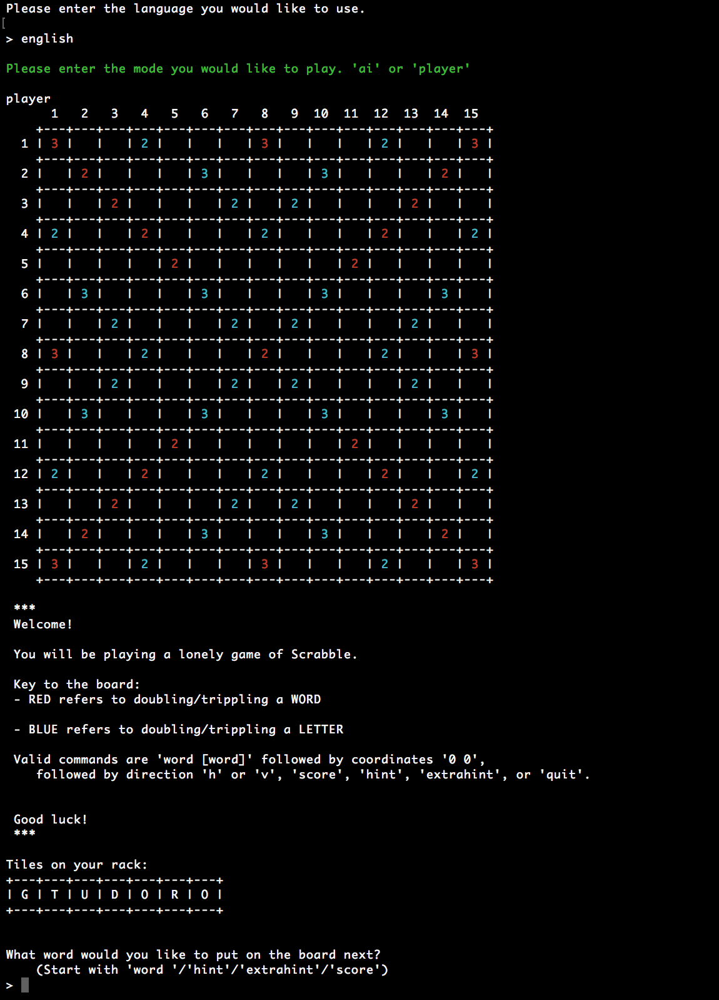

# scrabble

This is a recreation of the Scrabble board game. The game itself has an interface with an ascii board and the current tiles that the player has, so it is easy for a normal person to visualize the game. The game follows most of the usual Scrabble rules that includes special tiles, counting multiple words over one round of the game, and checking if the word actually exists. In addition, it includes word hints (a hint usually gives the player a word where one of the letters is already on the board), and another player, so that the user can play against AI and AI can play against AI. 

